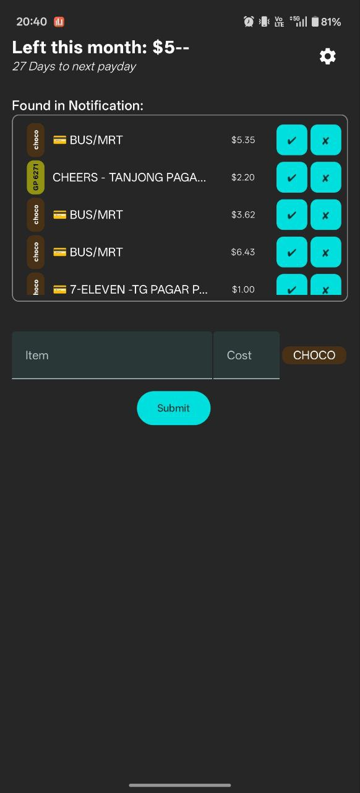
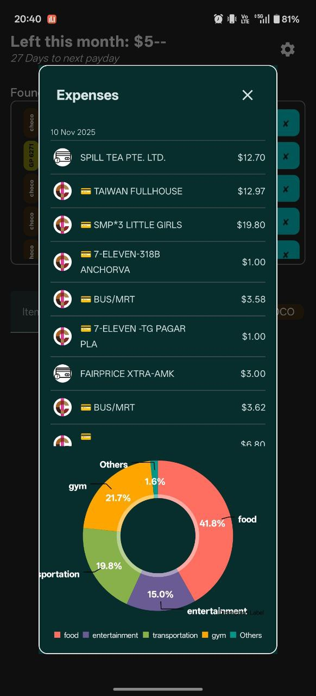
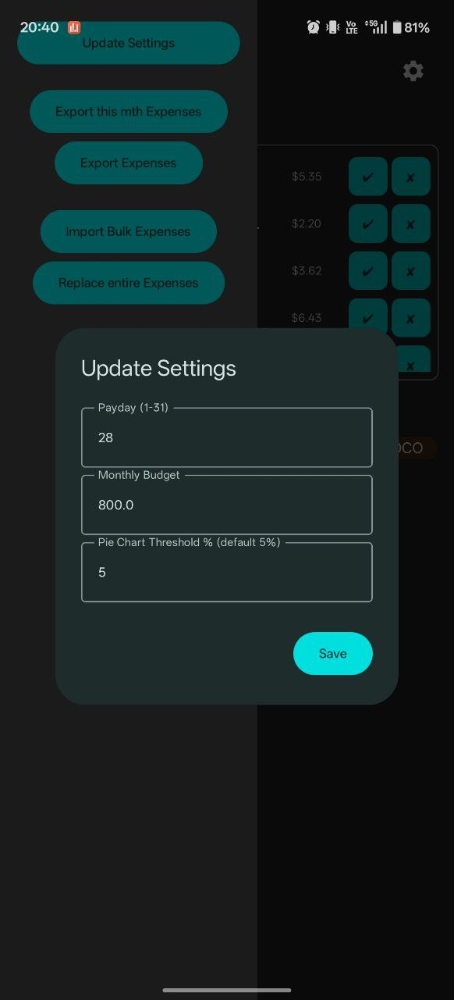

<h1>🚀 MoneyTracker</h1>

MoneyTracker is a simple Android app for tracking monthly expenses, visualizing spending by category, and managing your budget. Built with Kotlin and Jetpack Compose, it provides a clean, dark-themed interface and intuitive controls for expense management.

<h2>⭐ Features</h2>

<h3>Home Page</h3>
<ul>
<li>View your remaining budget for the month</li>
<li>Days to next payday</li>
<li>List of expenses detected from notifications</li>
    &mdash; Can choose to add or not to add to the listing
</ul>

<h3>Expense Entry</h3>
<ul>
<li>Option to manually add expenses if notification is not detected</li>
</ul>

<h3>Expense Review</h3>
<ul>
<li>View all expenses with the latest date at the top</li>
<li>See pie chart breakdown by category</li>
</ul>

<h3>Settings Dialog</h3>
<ul>
<li>Update payday</li>
<li>Update monthly budget</li>
<li>Adjust pie chart threshold</li>
</ul>

<h3>Import/Export</h3>
<ul>
<li>Export expenses to Excel</li>
<li>Import bulk expenses</li>
<li>Replace all expenses from a file</li>
</ul>

<h3>Notification Integration</h3>
<ul>
<li>Detect expenses from notifications for quick entry</li>
</ul>

<h2>📱 Screenshots</h2>

<table>
<tr>
<td align="center">
<h3>Home Page</h3>

</td>
<td align="center">
<h3>Expenses & Pie Chart</h3>

</td>
<td align="center">
<h3>Settings Dialog</h3>

</td>
</tr>
</table>

<h2>🛠️ Getting Started</h2>

<h3>Prerequisites</h3>
<ul>
<li>Android Studio (Arctic Fox or newer)</li>
<li>Android device or emulator (API 26+)</li>
<li>Kotlin, Jetpack Compose, Room, Material3</li>
</ul>

<h3>Installation</h3>
<ol>
<li>Clone the repository:</li>
</ol>

<pre><code>git clone https://github.com/JasonTzg/MoneyTracker.git</code></pre>

<ol start="2">
<li>Open in Android Studio, then build and run on your device/emulator.</li>
</ol>

<h2>Usage</h2>
<ul>
<li>Launch the app to view your monthly budget and expenses</li>
<li>Add expenses manually or from notifications</li>
<li>Use the sidebar to update settings, import/export data, or enable notification access</li>
</ul>

<h2>📂 Project Structure</h2>
<pre><code>MoneyTracker/
│
├── MainActivity.kt        # Main UI and navigation
├── data/                  # Room DB entities and DAOs
├── ui/theme/              # App theming
└── CommonUtil.kt          # Import/export and helper functions</code></pre>

<h2>🤝 Contributing</h2>

Pull requests are welcome. For major changes, please open an issue first to discuss what you would like to change.

<h2>📄 License</h2>

This project is licensed under the MIT License.

